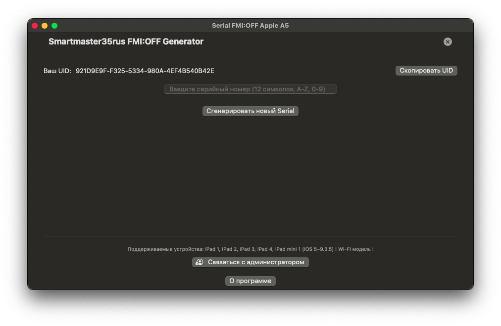
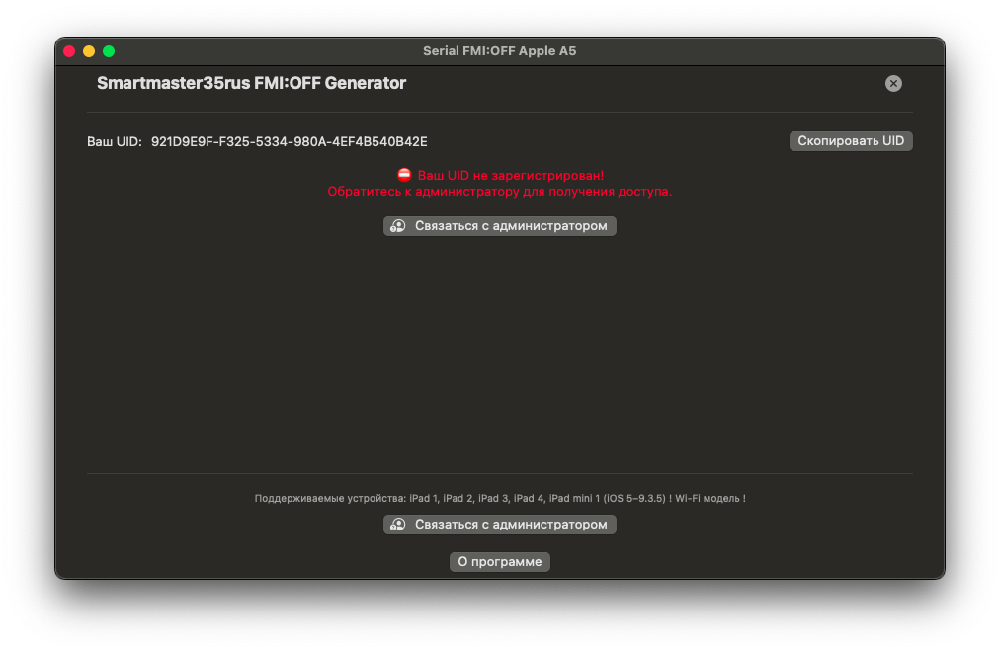

# SerialFMIOFFAppleA5

Утилита для macOS, предназначенная для работы с серийными номерами и вспомогательными ключами платформы Apple.

## Возможности

- Получение системной информации о вашем Mac
- Генерация, анализ и проверка ключей (серийников, вспомогательных идентификаторов)
- Автоматическая обработка и экспорт результатов
- Совместимость с Intel и Apple Silicon (M1/M2 и новее)
- Удобный графический интерфейс

## Требования

- macOS 11.5 или новее
- Процессор Intel или Apple Silicon

## Установка

1. Скачайте последнюю версию приложения из раздела [Releases](https://github.com/yourusername/SerialFMIOFFAppleA5/releases) на GitHub.
2. Переместите `SerialFMIOFFAppleA5.app` в папку `Программы` (`/Applications`).
3. Запустите приложение из папки программ.

## Быстрый старт

1. Откройте главное окно приложения.
2. Воспользуйтесь нужным разделом:
    - Получение информации о системе
    - Генерация, анализ или проверка ключей
    - Экспорт данных
3. Следуйте подсказкам интерфейса.

## Внимание

Некоторые функции предназначены только для технических специалистов и владельцев устройств Apple.

## Лицензия

Проект распространяется по лицензии MIT. Полный текст лицензии — в файле [LICENSE](LICENSE).

